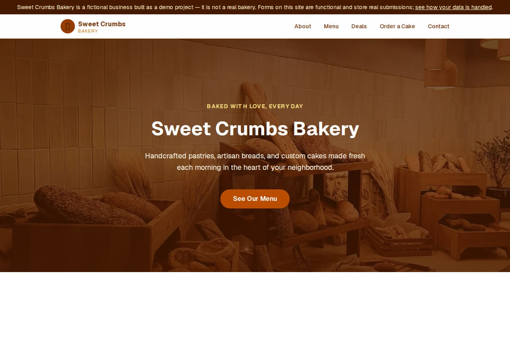
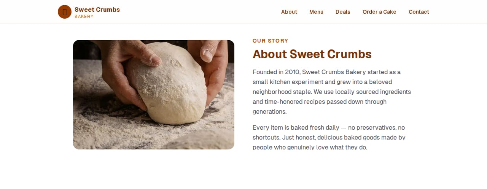
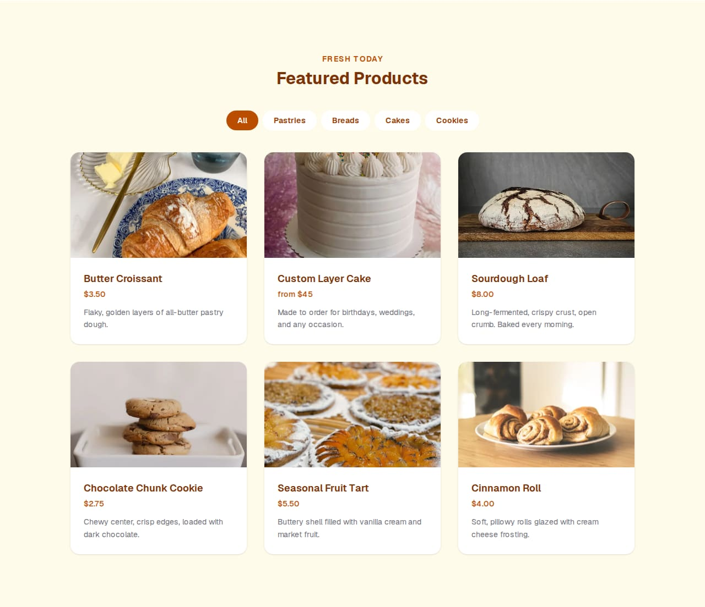
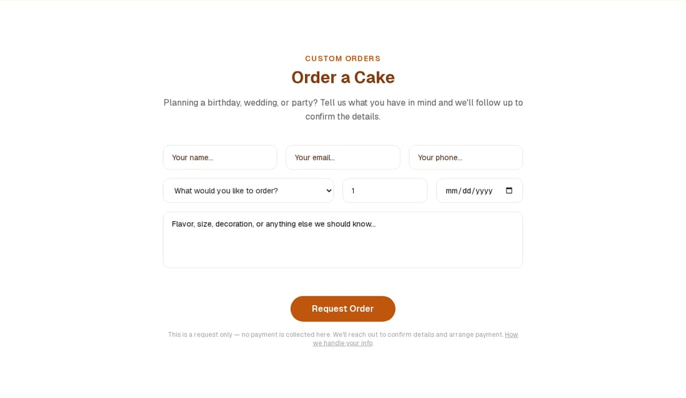
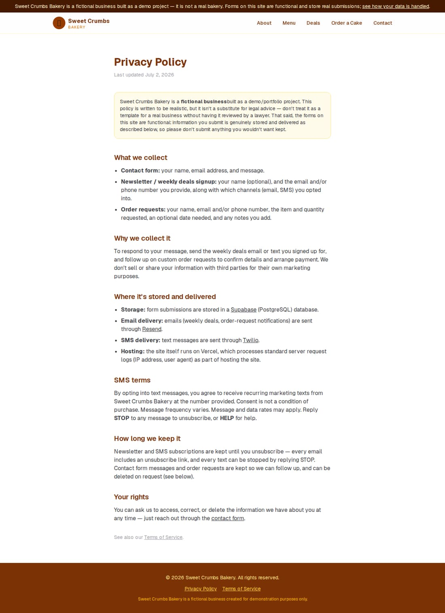
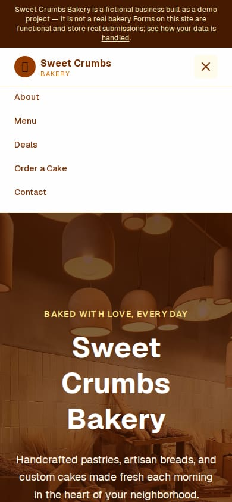

# Sweet Crumbs Bakery

A marketing site for a **fictional** neighborhood bakery, built to demonstrate a production-shaped Next.js App Router setup: server actions backed by Supabase, transactional/marketing email and SMS via Resend and Twilio, a scheduled cron job, and SEO/OG image generation — not just a static template.

> **This is a demo project.** Sweet Crumbs Bakery is not a real business. The forms are fully functional, though — submissions are genuinely stored and delivered as described in [Data flow](#data-flow) below, so don't submit anything you wouldn't want kept. See the in-app [Privacy Policy](app/privacy/page.tsx) and [Terms](app/terms/page.tsx) for the full disclosure.

## Screenshots

| | |
|---|---|
|  |  |
| Hero, sticky nav, and the demo-disclosure banner | About section |
|  |  |
| Menu grid with category filter (all photos are free-license stock, see [`public/images/CREDITS.md`](public/images/CREDITS.md)) | Custom order-request form |
|  |  |
| Privacy policy — explains what's collected and where it goes | Mobile nav |

## Features

- **Marketing homepage** — hero, about, filterable menu grid, newsletter signup, custom order request, contact form (`app/page.tsx`)
- **Menu filtering** — client-side category filter (Pastries/Breads/Cakes/Cookies) over a static product list
- **Order-request workflow** — a request-only intake form (no payment) that stores to Supabase and emails a notification; see [Data flow](#data-flow)
- **Newsletter (email + SMS)** — double-channel opt-in, welcome message on signup, weekly deals broadcast via a Vercel Cron job, and a one-click unsubscribe link
- **SEO** — per-page metadata, `robots.txt`/`sitemap.xml`, JSON-LD `Bakery` structured data, and generated OG/Twitter share images + favicon/apple-icon (all via `next/og`, see `app/opengraph-image.tsx`, `app/icon.tsx`, `app/apple-icon.tsx`)
- **Legal pages** — `/privacy` and `/terms`, written for this project specifically (not generic boilerplate)
- **Accessibility** — skip link, honeypot fields (not visible CAPTCHAs), `aria-live` form status regions, reduced-motion-aware animations

## Tech stack

| Layer | Choice |
|---|---|
| Framework | [Next.js 16](https://nextjs.org) (App Router, Turbopack) |
| UI | React 19, Tailwind CSS v4 |
| Animation | GSAP + `@gsap/react` (`ScrollTrigger`, respects `prefers-reduced-motion`) |
| Database | [Supabase](https://supabase.com) (Postgres, row-level security) |
| Email | [Resend](https://resend.com) |
| SMS | [Twilio](https://www.twilio.com) |
| Hosting | [Vercel](https://vercel.com) (Cron Jobs, Image Optimization) |

## Architecture

### Rendering & caching

The homepage (`app/page.tsx`) is fully static content — no per-request data fetching — so it's prerendered at build time with `export const revalidate = 86400`, giving fast static-HTML delivery with a daily ISR refresh (mainly to keep the footer's copyright year current). `robots.ts`/`sitemap.ts` and the generated OG/icon images (`app/opengraph-image.tsx`, `app/icon.tsx`, `app/apple-icon.tsx`, `app/twitter-image.tsx`) are all statically generated at build time too, since none of them read request-time data.

### Data flow

All three forms (contact, newsletter, order request) follow the same shape: a client component (`components/*Form.tsx`) calls a Server Action in `app/actions.ts` via `useActionState`, with a honeypot field for basic bot filtering.

```
NewsletterForm / OrderForm  →  app/actions.ts (Server Action)
                                 ├─ validate + normalize input
                                 ├─ insert row → Supabase (anon key, RLS: insert-only)
                                 └─ best-effort notification
                                      ├─ email → Resend  (lib/resend.ts)
                                      └─ SMS   → Twilio  (lib/twilio.ts)
```

- **Newsletter signup** inserts into `subscribers` and sends a welcome email/SMS.
- **Order request** inserts into `order_requests` and emails a notification to `BAKERY_ORDER_NOTIFICATION_EMAIL` — no payment is collected, it's a request the bakery follows up on.
- **Contact form** validates and (per its `TODO`) is the one form not yet wired to a delivery provider.
- **Weekly deals broadcast** (`app/api/cron/weekly-deals/route.ts`) is triggered by the Vercel Cron defined in `vercel.json`, authenticated via a `CRON_SECRET` bearer token, and fans out to all `active` subscribers through Resend/Twilio.
- **Unsubscribe** (`app/api/unsubscribe/route.ts`) is a token-based GET link included in every email; it uses the Supabase *service-role* client (bypasses RLS) since it needs to update rows it doesn't own, and responds with `Cache-Control: no-store` since it mutates state.

Both Supabase tables (`subscribers`, `order_requests`) have row-level security enabled with an `anon`-role, insert-only policy — the public key used by the browser/server-action client can create rows but never read, update, or delete them. Only the service-role client (used exclusively by the cron job and the unsubscribe route) can do that.

### Project structure

```
app/
  page.tsx                 homepage (composes the section components below)
  actions.ts                Server Actions: contact, newsletter, order request
  layout.tsx                 root layout: metadata, DemoBanner, Navbar, StructuredData
  privacy/, terms/           legal pages
  api/
    cron/weekly-deals/       Vercel Cron target — weekly broadcast
    unsubscribe/             token-based unsubscribe link target
  opengraph-image.tsx, twitter-image.tsx, icon.tsx, apple-icon.tsx
                             generated share-image/favicon routes (next/og)
  robots.ts, sitemap.ts      generated SEO files
components/                 one component per homepage section, plus shared chrome
  Navbar.tsx, Logo.tsx, DemoBanner.tsx, Footer.tsx
  Hero.tsx, About.tsx, FeaturedProducts.tsx, Order.tsx, Newsletter.tsx, Contact.tsx
  *Form.tsx                  client components wrapping each Server Action
  ScrollReveal.tsx, ProductGridReveal.tsx
                             GSAP scroll-in animation wrappers
lib/
  supabase.ts                anon + service-role Supabase client factories
  resend.ts, twilio.ts       email/SMS send helpers
content/                    copy for transactional messages (welcome, weekly deal)
public/images/               stock photography (see CREDITS.md for licensing)
```

## Getting started

```bash
npm install
cp .env.local.example .env.local   # fill in Supabase/Resend/Twilio credentials
npm run dev
```

Open [http://localhost:3000](http://localhost:3000).

See `.env.local.example` for the full list of required environment variables and where to get each one (Supabase project settings, Resend API keys, Twilio console).

## Deployment

Deployed on Vercel. `vercel.json` defines the weekly-deals cron schedule. Set the same environment variables from `.env.local.example` in the Vercel project settings, and make sure `NEXT_PUBLIC_SITE_URL` points at the real production domain — it drives canonical URLs, the sitemap, robots.txt, and unsubscribe links.
